#开源版本系统Gitlab使用
[TOC]

##1. Gitlab信息
访问地址：[http://gitlab.pinbot.me/](http://gitlab.pinbot.me/)

账号：研发组每人对应的拼音名  
密码：qwer@123

账号登录：
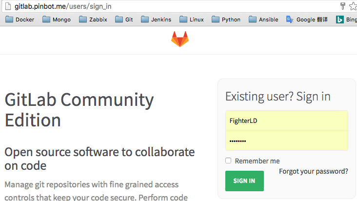

##2. Gitlab使用指引
gitlab主界面：
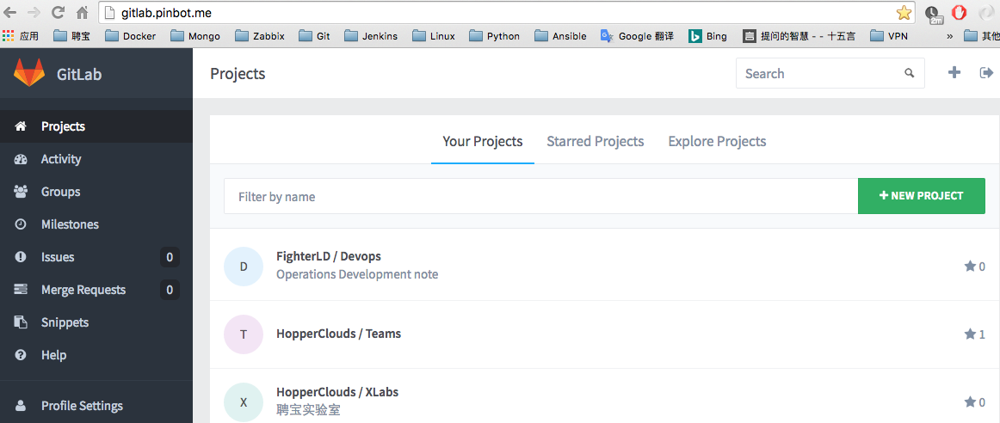

gitlab个人设置：
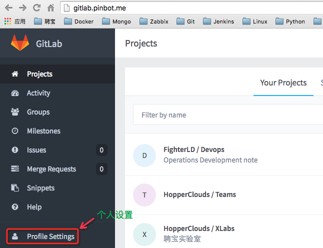

修改密码：
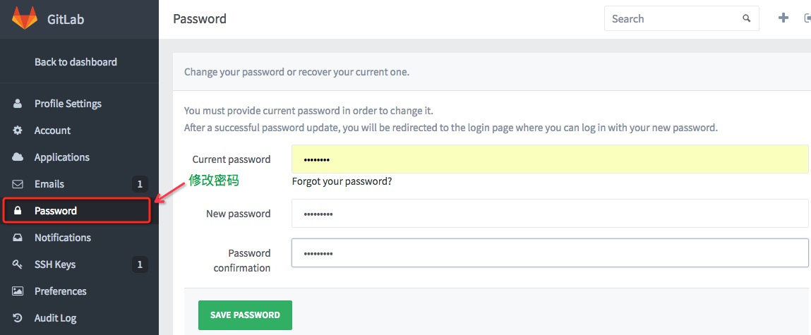

查看本机SSH-key：
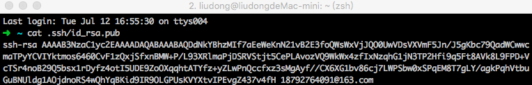

gitlab SSH-key 设置：
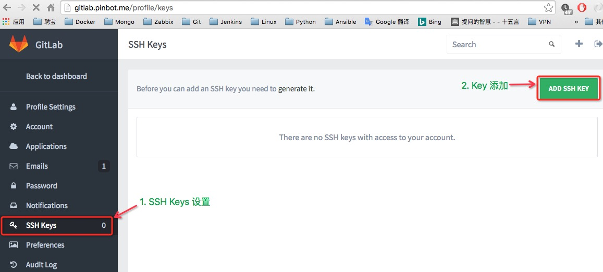

SSH-key添加：
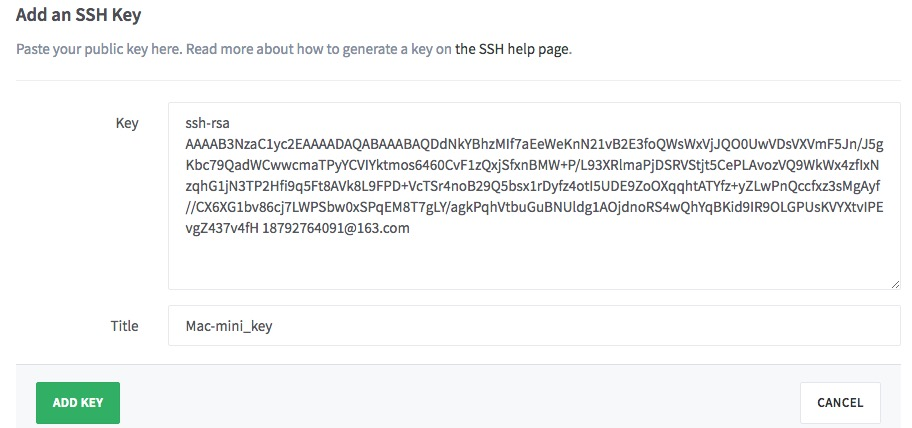

添加完成界面：
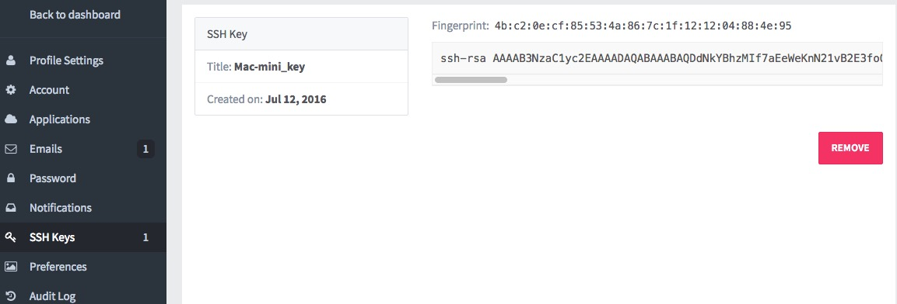

##3. Gitlab新建项目
项目设置：
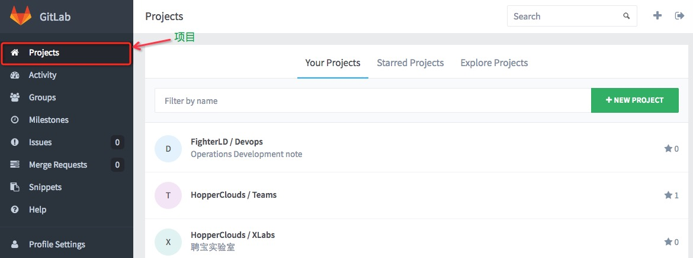

进入新建项目：
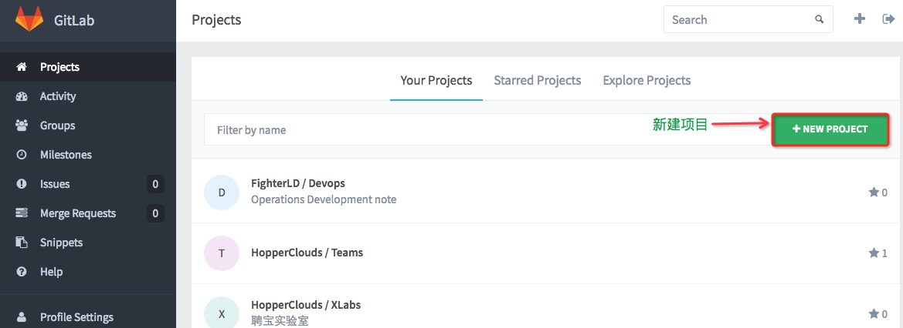

新建项目设置：
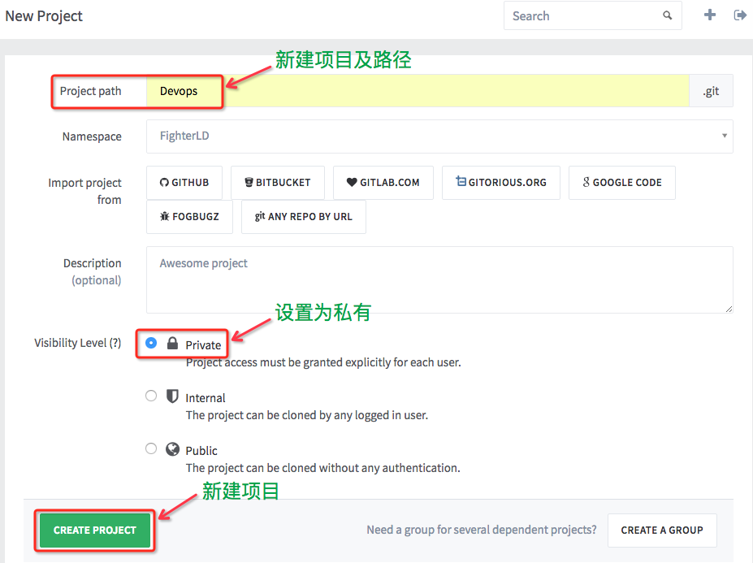

注：新建项目必须有内容才能Fork，例如：添加README.md

##4. Gitlab Fork项目
选择需要fork的项目并进入：
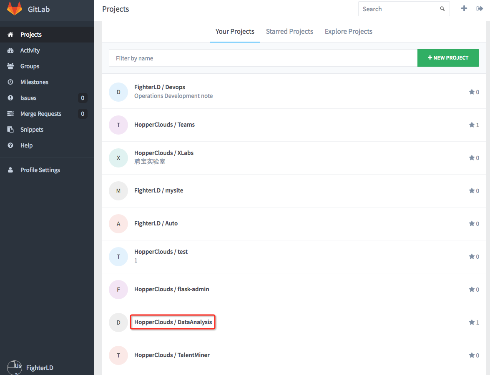

选择fork：
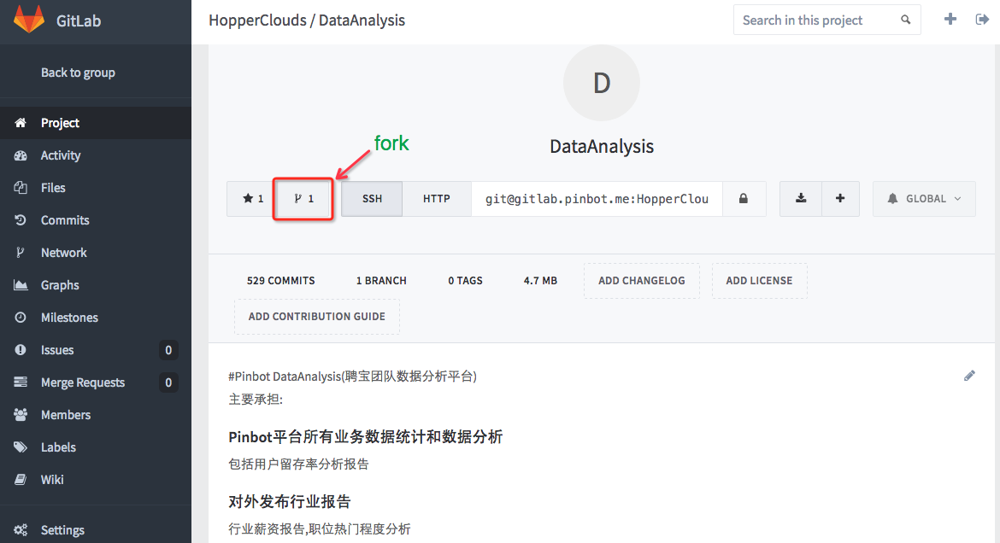

选择需要fork此项目的用户：
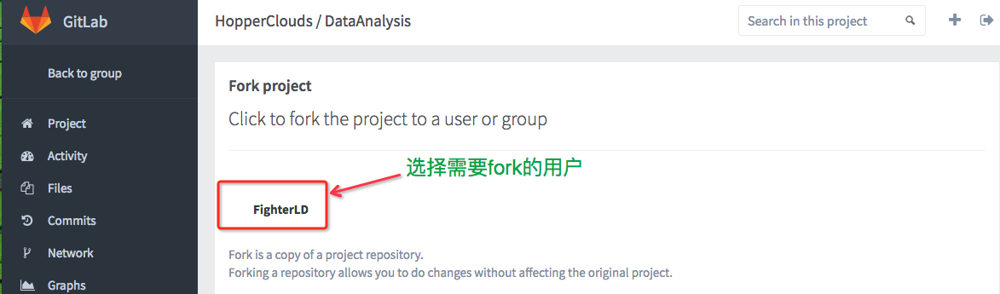

正在fork项目中：
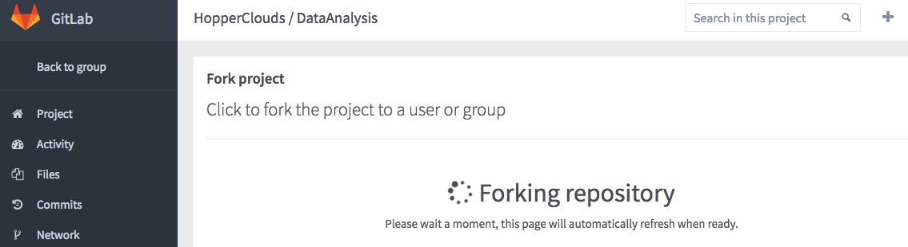

项目已经fork成功到用户中:
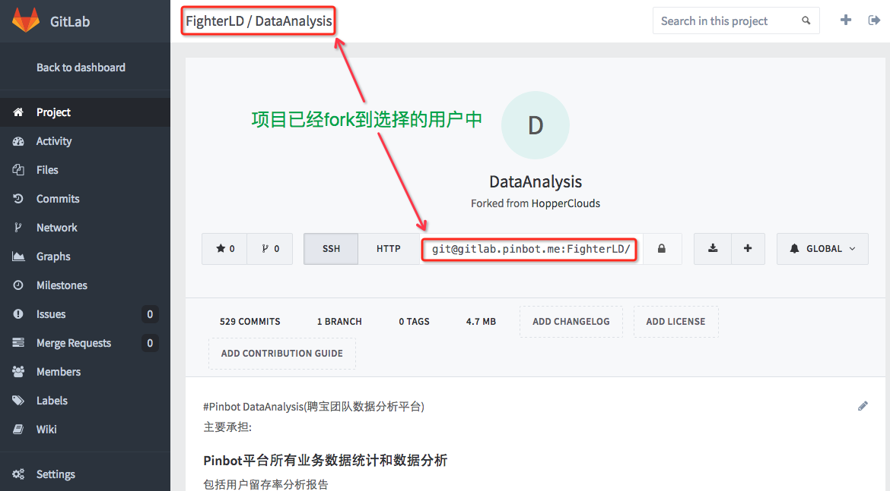

查看用户下的项目：
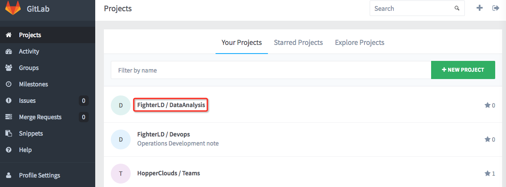

##5. Clone项目到Linux机器
进入项目并复制git链接：
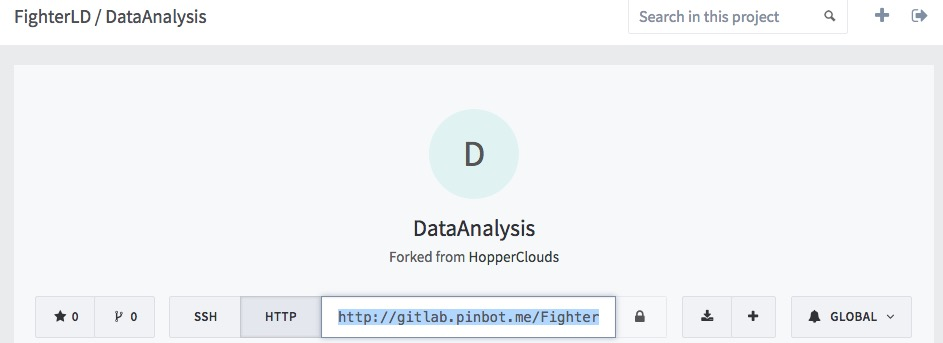

在Linux机器clone此项目:
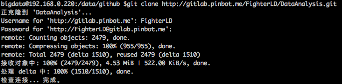

查看项目分支及状态：
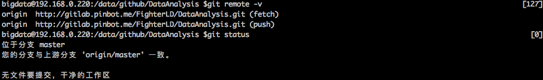

##6. Linux机器中使用gitlab(和github命令一致)
查看git分支及状态：
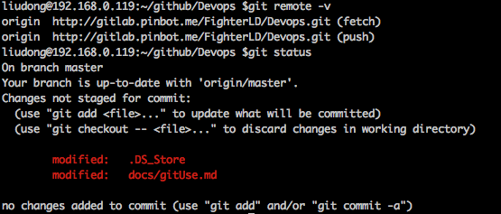

添加修改并提交：
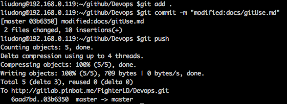

