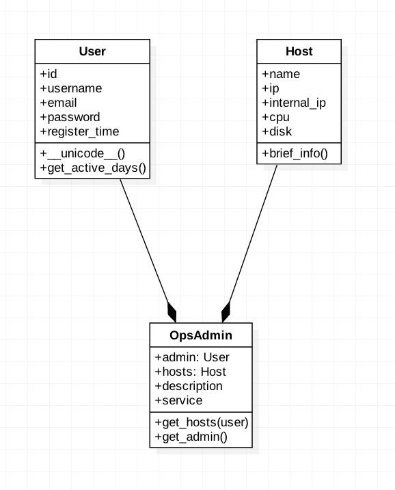

#Python语言基础

##1、环境搭建
-  Python 2.7.*
-  Mac or  Ubuntu Kylin
-  [Eclipse IDE for Java Developers](http://www.eclipse.org/downloads/)
-  [Pydev](http://www.pydev.org/download.html) Last Site Update: 22 March 2016 | Latest Version: 4.5.5

###Python环境搭建

- [pip](https://pip.pypa.io/en/stable/)
	- [官方文档](https://pip.pypa.io/en/stable/)
	- 作用
	- 基本命令: ` install, uninstall, list, freeze`
	- [参考手册](https://pip.pypa.io/en/stable/reference/)
	- 加速配置
	
```
vim ~/.pip/pip.conf 加入这个配置使用doubanio的源,可以加速下载python相关依赖包

[global]
index-url = http://pypi.doubanio.com/simple  
trusted-host = pypi.doubanio.com  
```
如果找不到路径:

`mkdir ~/.pip`

验证:
随意下载一个 pip install -U ipython

可以看见: 源成为了doubanio

```特别特别注意一下``` ,这个地方配置前边不要有空格,前边配置为pypi.douban.com要修改一下哈

- virtualenv
	- [官方文档]
	- 作用
	- 基本命令
	
`pip install virtualenv`
	
- virtualwrapper
	- [官方文档](https://virtualenv.pypa.io/en/latest/)
	- 作用
	- 基本命令
	
`pip install virtualenvwrapper`
```
 #python virtualenv管理工具,避免各种virtualenv太多目录各种散落
 if [ -f /usr/local/bin/virtualenvwrapper.sh ]; then
 export WORKON_HOME=$HOME/.virtualenvs
 source /usr/local/bin/virtualenvwrapper.sh
 fi

```

新打开一个terminal

`workon`

`mkvirtualenv courses`

在自己的~/.bash_rc加入


- ipython

`pip install ipython`

##Pydev环境搭建
- [Python Development with PyDev and Eclipse - Tutorial](http://www.vogella.com/tutorials/Python/article.html)
- [官网](http://www.pydev.org/index.html)


###Pydev快捷键和小技巧

- 配置多个虚拟环境. 以courses,IDC,DevOps
- [快捷键大全](http://www.cheatography.com/walthered/cheat-sheets/pydev-shortcut-cheat-sheet/)
- [快捷键](http://www.pydev.org/manual_adv_features.html)
- 简单程序调试
- [视频 Python Videos, Tutorials and Screencasts](http://showmedo.com/videotutorials/python)
- [视频: virtualenv](http://showmedo.com/videotutorials/series?name=mcfckfJ4w)
- [视频: 快捷键技巧](http://www.pydev.org/video_pydev_20.html)

###Pydev插件
- vrapper
- GFM: github flavor markdown
- AnyEdit Tools

###初识Python

- [很多人都会忽视的地方:Python官网](https://www.python.org/) 
- [Python官方文档](https://www.python.org/doc/)
- [Python 2.x文档](https://docs.python.org/2/)

- [中文版: Python Cookbook 3rd Edition Documentation](http://python3-cookbook.readthedocs.org/zh_CN/latest/index.html)
- [项目地址: Python Cookbook 3rd Edition Documentation](https://github.com/yidao620c/python3-cookbook)
- [Python 基础教程](http://www.runoob.com/python/python-tutorial.html)
- [搭建Python工程化开发框架](https://geosmart.github.io/2016/01/20/搭建Python工程化开发框架/)

##2、[基本操作](https://docs.python.org/2/tutorial/index.html)
###It works!!!

###输出/打印

- print
- [pprint](https://docs.python.org/2/library/pprint.html)
- format
- json.dumps

###输入

- raw_input
- sys.args
- OptionParser

###基本运算操作

###常用数据结构

- tuple
- list
	- 列表解析
- dict
- set

- 迭代器
	- yield


###效率提升数据结构

[collections](https://docs.python.org/2/library/collections.html)

- nametuple
- Counter
- defaultdict

其他非常有用的数据类型 

- [datetime,calendar,heapq](https://docs.python.org/2/library/datatypes.html)


##流程控制

- if/else
- for
- while
- break
- continue

##高阶函数(函数式编程)

- map
- reduce
- filter

###标准库

[The Python Standard Library](https://docs.python.org/2/library/index.html)

[Python标准库-中文版](http://python.usyiyi.cn/python_278/library/argparse.html)

[non-essential-built-in-functions](https://docs.python.org/2/library/functions.html#non-essential-built-in-functions)

- zip
- getattr
- setattr

[future_builtins](https://docs.python.org/2/library/future_builtins.html)

- unicode 和 str编码问题

###一切都很简单,但是我们得按规范干
- [Python语言规范,pep8](http://zh-google-styleguide.readthedocs.org/en/latest/google-python-styleguide/python_style_rules/)
	- 借助工具: pylint, Pydev 代码分析,格式化

####典型语言规范问题
- 函数/变量 [Python之父Guido推荐的规范](http://zh-google-styleguide.readthedocs.org/en/latest/google-python-styleguide/python_style_rules/#id16)
- 文件打开 [with使用](http://zh-google-styleguide.readthedocs.org/en/latest/google-python-styleguide/python_style_rules/#sockets)
- main函数 [恰当地使用__main__](http://zh-google-styleguide.readthedocs.org/en/latest/google-python-styleguide/python_style_rules/#main)


##3、类

### 基本概念
#### 类概念

- 类(Class): 用来描述具有相同的属性和方法的对象的集合。它定义了该集合中每个对象所共有的属性和方法。对象是类的实例。
   - 类变量：类变量在整个实例化的对象中是公用的。类变量定义在类中且在函数体之外。类变量通常不作为实例变量使用。
   - 数据成员：类变量或者实例变量用于处理类及其实例对象的相关的数据。
   - 类方法：类中定义的函数。
   - [从object继承](http://zh-google-styleguide.readthedocs.org/en/latest/google-python-styleguide/python_style_rules/#id11)

- 继承：即一个派生类（derived class）继承基类（base class）的字段和方法。继承也允许把一个派生类的对象作为一个基类对象对待。例如，有这样一个设计：一个Dog类型的对象派生自Animal类，这是模拟"是一个（is-a）"关系（例图，Dog是一个Animal）。

- 类方法重写：如果从父类继承的方法不能满足子类的需求，可以对其进行改写，这个过程叫方法的覆盖（override），也称为方法的重写。

- 基础重载方法

#### 多继承

#### 对象
-  类实例化：创建一个类的实例，类的具体对象。  
-  对象：通过类定义的数据结构实例。对象包括两个数据成员（类变量和实例变量）和方法。  
-  实例变量：定义在方法中的变量，只作用于当前实例的类。

### 使用mongoengine和flask_admin实战类与继承[`精读以下文档`]
#### mongoengine
[官方文档,快速入门,使用](http://docs.mongoengine.org/)  
[MongoDB 教程,了解基本概念,增删查改一定要会](http://www.runoob.com/mongodb/nosql.html)  
[中文版]+MongoDB权威指南 书
[mongodb数据库官网文档](https://docs.mongodb.org/)

#### flask_admin
[Flask-Admin快速入门,概览很简单](http://ericzhong.github.io/2013/12/17/flask-admin/)  
[Flask中文教程,非常值得研究](http://docs.jinkan.org/docs/flask/)  
[Flask_admin官方文档, 做技术英文文档绕不过去,多多读](http://flask-admin.readthedocs.io/en/latest/)  


```python
# coding:utf-8
'''
Created on 2016年4月24日

@author: likaiguo
'''
from __future__ import print_function, unicode_literals
import datetime


class User(object):
    """
    用户类
    """

    id = 0
    username = ''
    email = ''
    password = ''
    regiter_time = datetime.datetime(2014, 12, 10)

    def __init__(self, username=''):
        self.username = username

    def __str__(self):

        return 'User: %s' % self.username

    def get_register_date(self):

        return datetime.datetime.now() - self.regiter_time

    def get_register_days(self):
        """
        获取注册天数
        """
        delta = self.get_register_date()

        return delta.days

    @staticmethod
    def print_hello(x='hello'):

        print(x)

    @property
    def register_days(self):

        return self.get_register_days()

    @property
    def regiter_seconds(self):
        delta = self.get_register_date()
        return delta.seconds


class Utils(object):

    @staticmethod
    def print_json(data):
        import json
        print(json.dumps(data, indent=4, ensure_ascii=False))


class SubUser(User):

    def __init__(self, username=''):

        self.username = 'sub_username: %s' % username

    def get_register_days(self):
        days = User.get_register_days(self)
        return str(days)


if __name__ == '__main__':

    user = User()
    user.username = 'likaiguo'

    print(user.username)
    print("id:%d : username: %s" % (user.id, user.username))
    days1 = user.get_register_days()
    user2 = SubUser()
    days2 = user2.get_register_days()

    user3 = User(username='likaiguo-2')

    print(user3)

    user4 = SubUser(username='likaiguo-3')

    print(user4)

    User.print_hello(x='haowan-hello')

    Utils.print_json(data={'name': '李开国', 'id': 100, 'other': {1: 2}})

    print(user4.register_days)

```

####装饰器

- @staticmethod
- @classmethod
- @property
- 自定义装饰器


###从零开始构造类(Host,User)



###从mongoengine继承
- 连接数据库
- 写入数据
- 验证写入

###与flask_admin集成
- 展示到页面


```python
# coding:utf-8
'''
Created on 2016年4月23日

@author: likaiguo

第一步:  workon  haowan-courses
第二步: pip install mongoengine
第三步: 写下面的程序

'''
from __future__ import unicode_literals, print_function
import datetime
from mongoengine import Document, StringField, DateTimeField
from mongoengine import connect


# 连接mongo数据库:haowan
HOST = '192.168.8.108'

connect('haowan', host=HOST)


class Host(Document):
    """
    数据库模型
    """

    name = StringField()
    add_time = DateTimeField(default=datetime.datetime.now())

    meta = {
        'collection': 'host',
    }


if __name__ == '__main__':
    from flask import Flask
    import flask_admin as admin
    from flask_admin.contrib.mongoengine import ModelView

    # Flask App
    app = Flask('hello')
    app.config['SECRET_KEY'] = '123456790'

    # 用flask_admin来展示
    admin = admin.Admin(app, u'聘宝数据分析平台')
    admin.add_view(ModelView(Host))
    app.run(debug=True)


```

### 大家存在的一些问题

- 代码规范: 注释位置,命名
- 理解你正在写的程序


##4、All in One 完成一个复杂任务

## 善用工具:pydev
-  代码风格统一: 自动sort import包,编辑器format代码
-  自定义风格: pep8各种警告,ignore
-  学会使用调试: 一定要爱上调试(F5,F6,F7);调试和运行(F11,Ctrl+F11)

### 测试
[用Python编写干净、可测试、高质量的代码](https://www.ibm.com/developerworks/cn/aix/library/au-cleancode/)

编写软件是人所承担的最复杂的任务之一。
AWK 编程语言和 "K and R C" 的作者之一 Brian Kernigan 在 Software Tools 一书中总结了软件开发的真实性质，
**“控制复杂性是软件开发的根本。”**

- 成功的软件开发人员会按照便于自动化的方式运行测试，这样就可以不断地证明软件工作正常。
- 他们严格地遵守自己的方法，在每个阶段都进行认真的复查，寻找重构的机会。
- 他们经常思考如何确保其软件是可测试、可读且可维护的。


#### 测试的重要性
[提高你的Python能力：理解单元测试](http://blog.jobbole.com/55180/)

- 测试可以保证你的代码在一系列给定条件下正常工作
- 测试允许人们确保对代码的改动不会破坏现有的功能
- 测试迫使人们在不寻常条件的情况下思考代码，这可能会揭示出逻辑错误
- 良好的测试要求模块化，解耦代码，这是一个良好的系统设计的标志

#### Python中的测试框架
- doctest  标准库
- unittest 标准库
- nose 第三方框架,各种插件

各种应对的场景不同,洞悉各个优秀的开源项目.例如: pyes,flask_admin,flask,django

#### 练习单元测试: 一定要动起手来,一定要练
[ doctest、unittest 和 nose速览](http://hahack.com/wiki/python3-unittest.html)


###IDC项目的各个细节
其中涉及到django的开发,基础信息包使用psutil, platform

从最简单的开始
### psutil使用
[psutil官方文档](https://pythonhosted.org/psutil/)
[源码](https://github.com/giampaolo/psutil)
[赏析flask,psutil,bootstrap案例](https://github.com/likaiguo/psdash)

### platform使用
[python标准库:platform](https://docs.python.org/2/library/platform.html)

[使用 Python 获取 Linux 系统信息](http://www.oschina.net/translate/linux-system-mining-with-python)

### 初识django
我最喜欢的是django的官方文档. 结合查询特定的中英文资料对单个点理解,再回去看官方文档.

django之所以成为Python社区中最流行的Web框架,其中最重要一点是其文档详实.

[django 1.8.2中文翻译文档](http://python.usyiyi.cn/django/index.html)
[编写你的第一个Django应用](http://python.usyiyi.cn/django/intro/tutorial01.html)

这个教程的千万千万一定要把序言和tutorial的前三节看了哈.


### 异常处理
- 异常捕捉

### 日志