#Jenkins持续集成服务器配置Linux(Ubuntu)
[TOC]
##持续集成使用阶段主要步骤

> * 程序员从源代码仓库下载最新程序
> * 程序员编写代码、测试用例，并提交更新结果给版本控制仓库
> * CI服务器根据触发条件，从版本控制仓库提取最新代码，交给构建工具的工作空间
> * 构建工具对代码进行编译、测试，并进行打包。如有必要，实现产品部署、发布
> * 通过构建工具与版本控制工具的配合，实现产品版本控制与管理
> * 建立、管理项目开发的工作网站

##1 安装JDK
```
sudo apt-get install openjdk-8-jdk

java -version   #查看是否安装java
java version "1.8.0_91"
Java(TM) SE Runtime Environment (build 1.8.0_91-b14)
Java HotSpot(TM) 64-Bit Server VM (build 25.91-b14, mixed mode)
```
##2 安装Jenkins
```
apt-get安装方式
#添加Jenkins安装key
wget -q -O - http://pkg.jenkins-ci.org/debian/jenkins-ci.org.key | sudo apt-key add -  
#添加Jenkins安装源列表
sudo sh -c 'echo deb http://pkg.jenkins-ci.org/debian binary/ > /etc/apt/sources.list.d/jenkins.list' 
sudo apt-get update
sudo apt-get install jenkins  
#直接把Jenkins当成服务安装，完成后访问：http://localhost:8080验证是否安装成功；
```
##3 Jenkins默认安装位置
```
安装目录：/var/lib/jenkins
日志目录：/var/log/jenkins/jenkins.log
```
##4 Jenkins服务启动、停止方法
```
sudo /etc/init.d/jenkins start
sudo /etc/init.d/jenkins stop
```

##5 访问Jenkins：
```
http://192.168.0.212:8080/
```
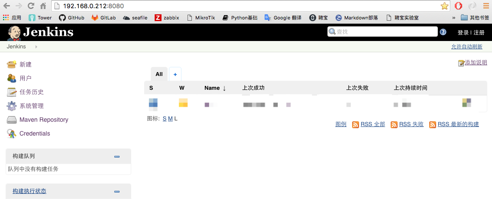
<authorizationStrategy class="hudson.security.GlobalMatrixAuthorizationStrategy"/>

##6 安装Jenkins plugins：
在线安装：
###6.1 进入系统管理
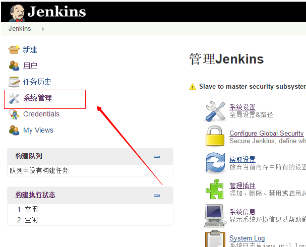
###6.2 选择插件管理
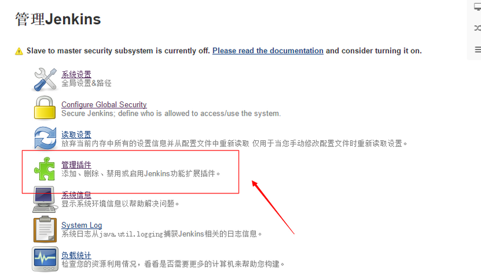
###6.3 切换到可选插件
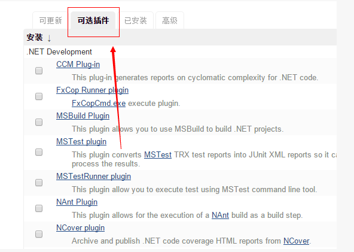
###6.4 选择插件直接安装
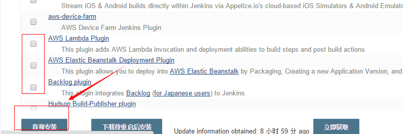
##7 账号安全配置
###7.1 配置全局安全认证
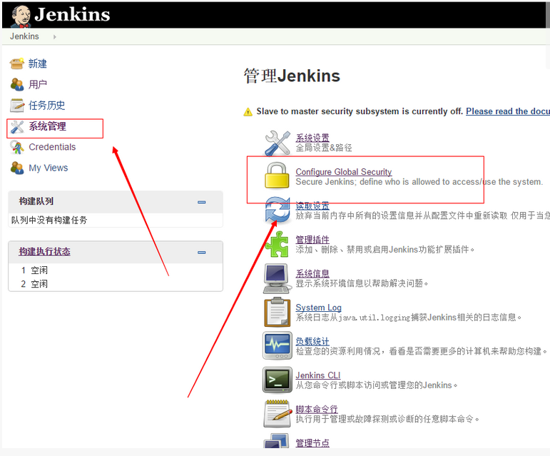
###7.2 选择Jenkins专用用户数据库，允许用户注册
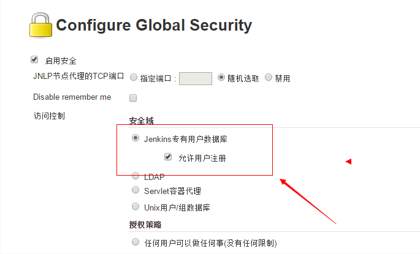
###7.3 注册用户

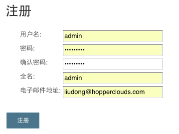
###7.4 启动安全矩阵，添加用户、权限
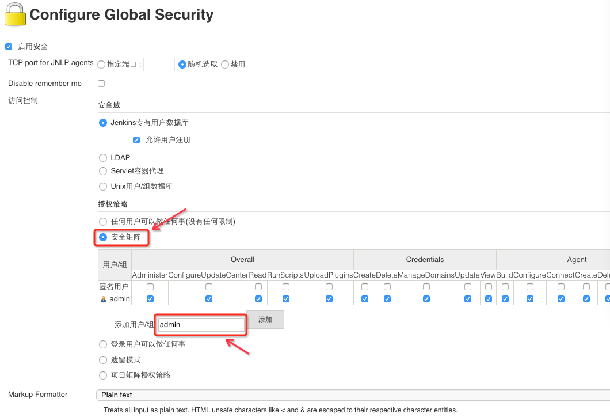
##8 环境变量设置
环境变量列表:

BUILD_NUMBER， 唯一标识一次build，例如23  
BUILD_ID，基本上等同于BUILD_NUMBER，但是是字符串，例如2011-11-15_16-06-21&&据说新版本只有一个ID，具体大家自己尝试下；  
JOB_NAME， job的名字，例如JavaHelloWorld；  
BUILD_TAG，作用同BUILD_ID,BUILD_NUMBER,用来全局地唯一标识一此build，例如jenkins-JavaHelloWorld-23；  
EXECUTOR_NUMBER， 例如0；  
NODE_NAME，slave的名字，例如MyServer01；  
NODE_LABELS，slave的label，标识slave的用处，例如JavaHelloWorldMyServer01；  
JAVA_HOME， java的home目录，例如C:\Program Files (x86)\Java\jdk1.7.0_01；  
WORKSPACE，job的当前工作目录，例如c:\jenkins\workspace\JavaHelloWorld；  
HUDSON_URL = JENKINS_URL， jenkins的url，例如http://localhost:8000/；  
BUILD_URL，build的url 例如http://localhost:8000/job/JavaHelloWorld/23/；  
JOB_URL， job的url，例如http://localhost:8000/job/JavaHelloWorld/；  
SVN_REVISION，svn 的revison， 例如4；  
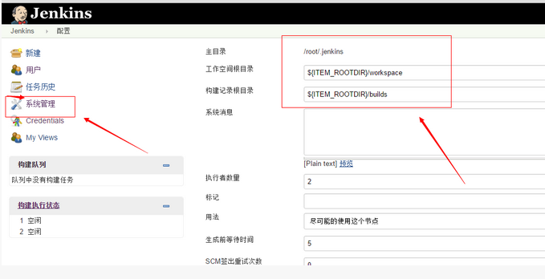
##9 Jenkins使用
###9.1 创建项目
输入项目名称，选择项目类型

项目描述
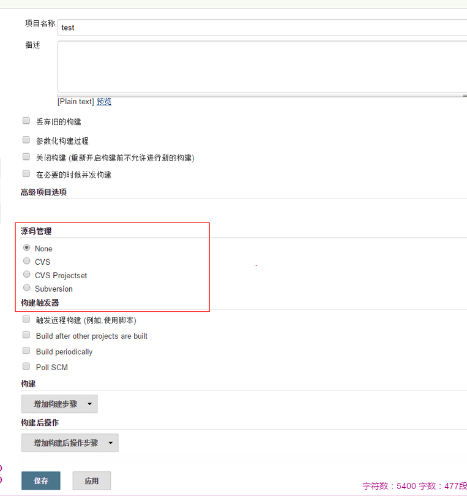
###9.2 项目构建
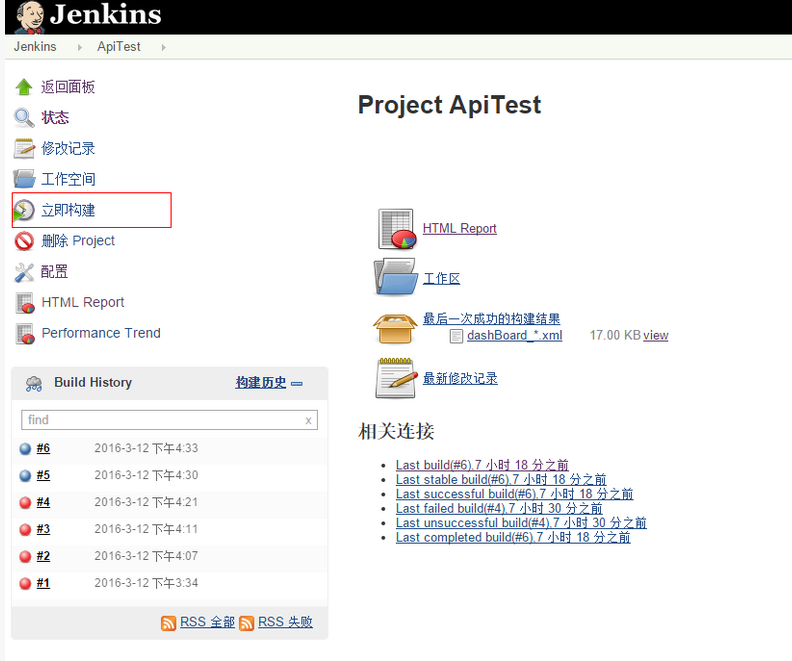
查看构建结果  
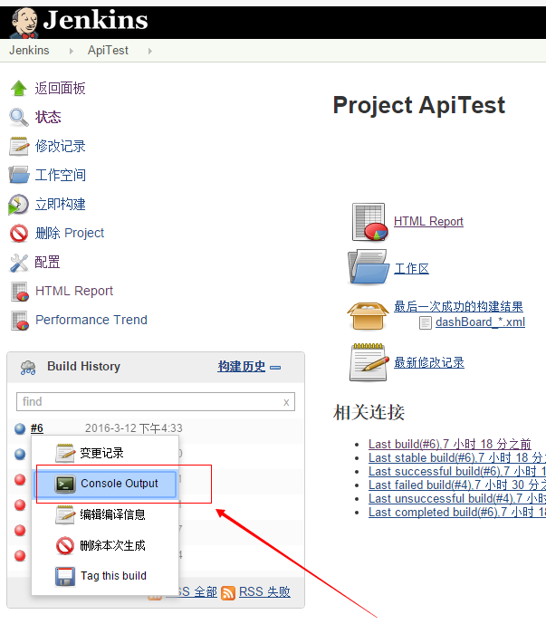
构建结果显示  
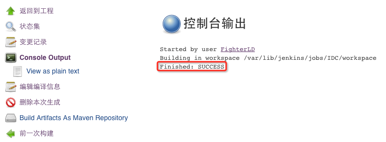