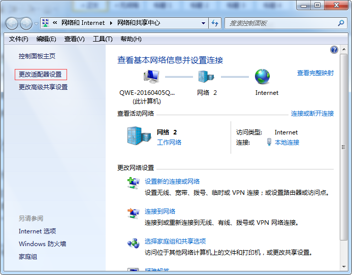
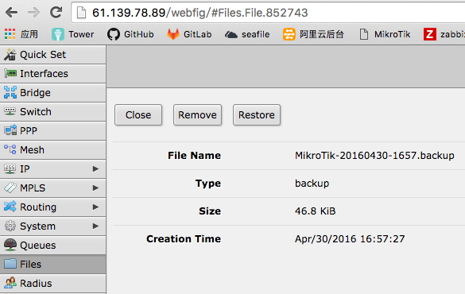

#网络操作手册
[TOC]
##1 网络信息状况
###1.1 30M电信光纤专线
对应外网IP:61.139.78.89  
所属IP网断：192.168.0.2—192.168.0.189,192.168.0.199-192.168.0.202  
所属交换机端口：ether8  
最大稳定宽带速度：3.75 M/s  
限制速度：3 M/s  
网关地址：61.139.78.0  
MAC地址：08:19:A6:24:08:EF  
获取方式：静态获取  

###1.2 100M拨号专线  
对应外网IP:动态IP
所属IP网断：192.168.0.199-192.168.0.202,192.168.0.203-192.168.0.254  
所属交换机端口：ether6  
最大稳定宽带速度：12.5 M/s  
限制速度：无限制  
网关地址：100.64.0.1  

交换机 DNS 地址：61.139.2.69  
DNS 所属地址：成都电信DNS  

###1.3 无线WIFI信息
|无线名	   |密码		       |所用IP	   |分配的IP   |
|------------|----------------|------------|-----------|
|Pinbot-Pro  |Hopperclouds2014|192.168.0.86|192.168.1.x|
|Pinbot-OP   |Hopperclouds2016|192.168.0.88|192.168.3.x|
|Pinbot-RD   |Hopperclouds2016|192.168.0.89|192.168.2.x|
|Pinbot-dev  |Hopperclouds2016|192.168.0.87|192.168.4.x|

注：Pinbot-Pro 公用，Pinbot_OP用于顾问团队，Pinbot_RD、Pinbot-dev用于研发

###1.4 公共网络信息
公网IP地址：[http://61.139.78.89](http://61.139.78.89)

###1.5 移动WIFI信息
|无线名		 |密码	  |管理后台	   |用户名|密码|
|--------------|---------|-----------|-----|-----|
|Pinbot-SOS-1  |pinbot123|192.168.0.1|admin|admin|
|Pinbot-SOS-2  |pinbot123|192.168.5.1|admin|admin|
|Pinbot-SOS-3  |pinbot123|192.168.6.1|admin|admin|
|Pinbot-SOS-4  |pinbot123|192.168.7.1|admin|admin|
|Pinbot-SOS-5  |pinbot123|192.168.8.1|admin|admin|

###1.6 各账号、设备信息
|设备/线路 |账号	         |信息	    |密码    |使用情况            |紧急联系方式 |
|---------|--------------|-----------|--------|------------------|-----------|
|商务光纤   |744000023613 |30M(固定IP)   |         |部分有线、部分无线    |17729839890|
|拨号宽带   |83330727     |100M(拨号IP） |83330727 |部分有线、部分无线    |18030417167、10000|
|专业路由器 |admin        |MikroTik-RouterOS|   |30M->ether8、100M->ether6|     |
|飞鱼星路由器| |      |         |                    ||

###1.7 移动WIFI设置信息  

移动WIFI测速信息：  

网络故故障等级排查及解决方法

##2 网络卡顿、延时等情况
###2.1 网络检查
1） 进入总路由后台管理系统（windows系统），浏览器直接进入  
后台管理地址：[http://61.139.78.89](http://61.139.78.89)  
[http://192.168.0.1](http://192.168.0.1)  

2） 检查网络流量情况：
进入系统后选择 Interfaces

其中ether8属于办公及内网服务器访问30M光纤产生的流量Tx下载(发送)总流量，Rx上传(接收)总流量  
ether6（pppoe-out1）属于办公及内网服务器访问100M拨号专线产生的流量

###2.2 故障分析  
1） 如果上传或者下载总流量单位以bps为单位时，表示总流量很小；  
2） 当流量大于100M时断定为网络风暴（内网机器磁盘、网卡损坏）；  
3） 对两个路由器进行单一插拔线路排除，确定内网故障机器；  
4） 找到内网故障机器，检查机器磁盘、网卡情况；  

##3 部分或者全部电脑5-10分钟断网
###3.1 网络连接设置检查
针对部分电脑检查网络IP是否冲突；  
打开电脑右下方任务栏网络图标——>选择网络共享中心  

——>更改适配器设置  

——>选择本地连接  

——>右键——>选择属性——>选择Internet 协议版本4（TCP/IPv4）  

——>属性——>检查是否为自动获取  

###3.2 故障解决方法
####3.2.1 软件配置问题
1） 进入总路由后台管理系统（windows系统），浏览器直接进入  
后台管理地址：[http://61.139.78.89](http://61.139.78.89)  
[http://192.168.0.1](http://192.168.0.1)  

2） 软件备份恢复：  
进入管理系统后

选择左边 Files ——>选择File Name为 MikroTik-20160430-1657.backup的文件

——>选择 Restore   进行正确的网络备份恢复

注：恢复期间，路由器会重新设置为网络备份的设置，也会重启交换机是配置生效，时间大概5-10分钟左右

##4 全部电脑断网超过10分钟
注：此时如果按照鼓故障等级2的处理方法也没网时，短时间内难以恢复，需要启动应急方案；
###4.1 应急方案一（电信网络都有问题）：
1) 将启用5个移动WIFI（目前有一个，后续会增加到5个，单个设备最大支持数为10，检测速度为997K/S）;  
2) 所有台式电脑安装无线网卡，网卡自带驱动;  
3) 连接移动WIFI共享出来的无线网络;  

注：刘毅、nina、慧琳的电脑在使用时需要先弹出CD/TP-Link网卡驱动，然后会再重装；

###4.2 应急方案二（电信网络正常，只是交换机硬件故障）：  
1) 将网络入口直接接入两个企业路由器进行无线共享；  
2) 所有台式电脑安装无线网卡，网卡自带驱动  
3) 连接共享出来的无线网络  

注：可根据网络情况，实时增加移动WIFI设备

