#Pinbot私有云使用手册
[TOC]

##私有云访问地址
- 内网地址：[http://192.168.0.190:8001/](http://192.168.0.190:8001/)
- 外网地址：[http://seafile.pinbot.me/](http://seafile.pinbot.me/)    [http://yun.pinbot.me/](http://yun.pinbot.me/)

- [seafile官方使用文档](https://www.seafile.com/help/)

##1 Seafile浏览器使用
###1.1 浏览器访问
办公环境建议直接访问内网地址：[http://192.168.0.190:8001/](http://192.168.0.190:8001/)  内网传输速度快
外网环境访问：[http://seafile.pinbot.me/](http://seafile.pinbot.me/)  [http://yun.pinbot.me/](http://yun.pinbot.me/)  内外网限制，只能从外网访问

邮箱：自己的聘宝邮箱，例：liudong@hopperclouds.com  
密码：邮箱中@符号前面的内容，例：liudong  

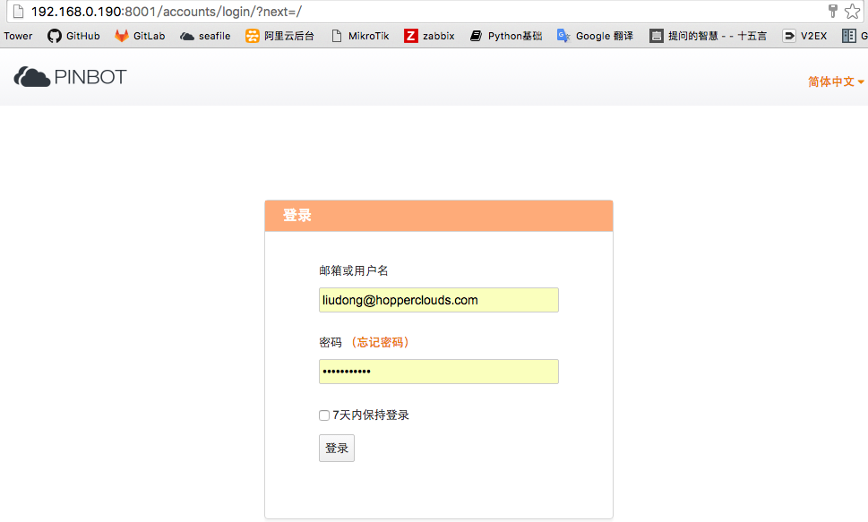

###1.2 非办公外网环境需要访问外网地址

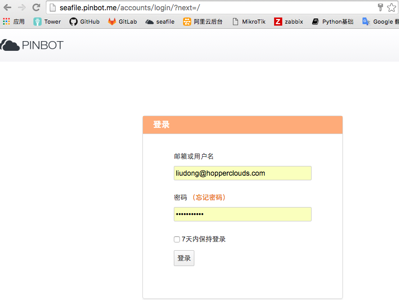

###1.3 文件共享方法
浏览器登录seafile主界面后
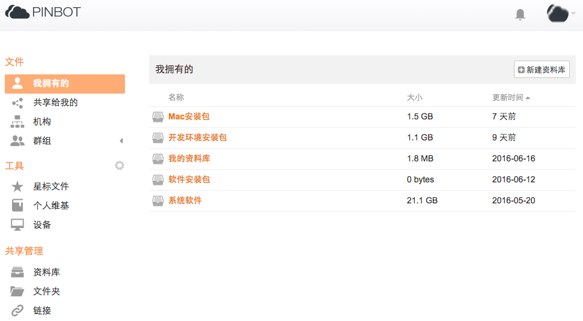

浏览器现有群组
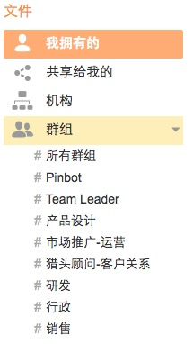

群组成员信息
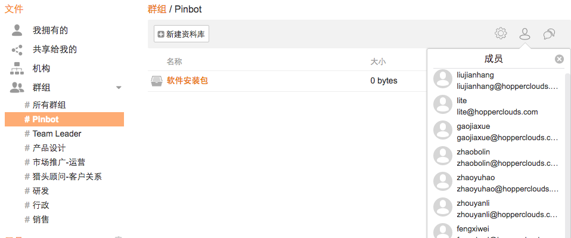

个人信息设置
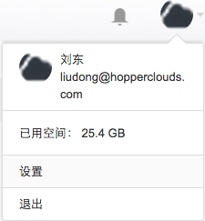

注：Pinbot组包含公司所有成员，其他各组成员是根据[Tower团队](https://tower.im/teams/a78e154e87914dce93b0e970be8de11c/members/)进行设置，如有其他需求，可进行更改设置；

选择文件共享
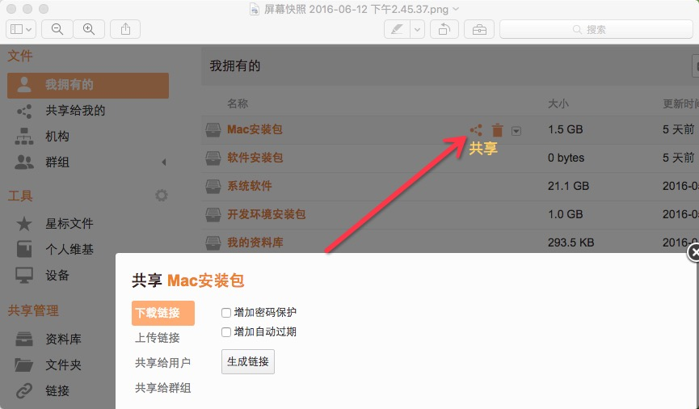

将文件/目录共享给其他用户(可选择所分享的文件目录的权限：只读/可读写)
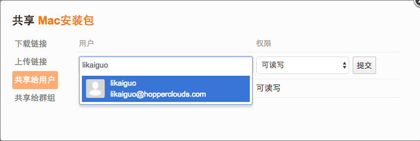

将文件/目录共享给其他组(可选择所分享的文件目录的权限：只读/可读写)
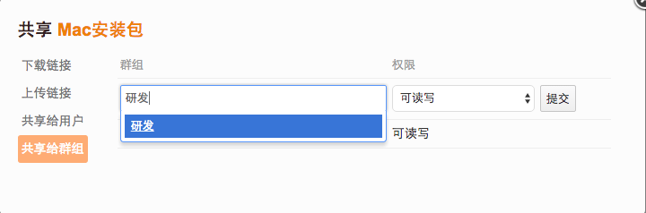

##2 Seafile客户端使用
###2.1 安装seaflie私有云客户端
下载地址：[https://www.seafile.com/download/](https://www.seafile.com/download/)
注：Windows和Mac根据设备下载对应的版本；

###2.2 登录访问账号
内网地址：[http://192.168.0.190:8001/](http://192.168.0.190:8001/)
外网地址：[http://seafile.pinbot.me/](http://seafile.pinbot.me/)

邮箱：自己的聘宝邮箱，例：liudong@hopperclouds.com  
密码：邮箱中@符号前面的内容，例：liudong  

###2.3 内网访问
内网直接访问：[http://192.168.0.190:8001/](http://192.168.0.190:8001/)
  

###2.4 外网访问
非办公外网环境需要访问外网地址：[http://seafile.pinbot.me/](http://seafile.pinbot.me/)
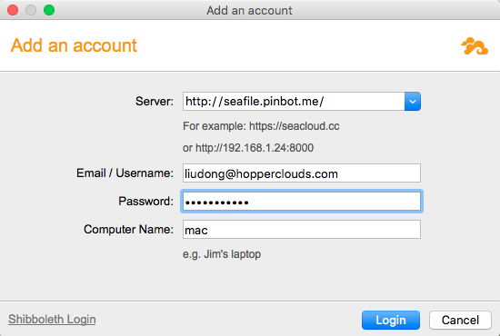

客户端登录主界面  

  

客户端操作界面  

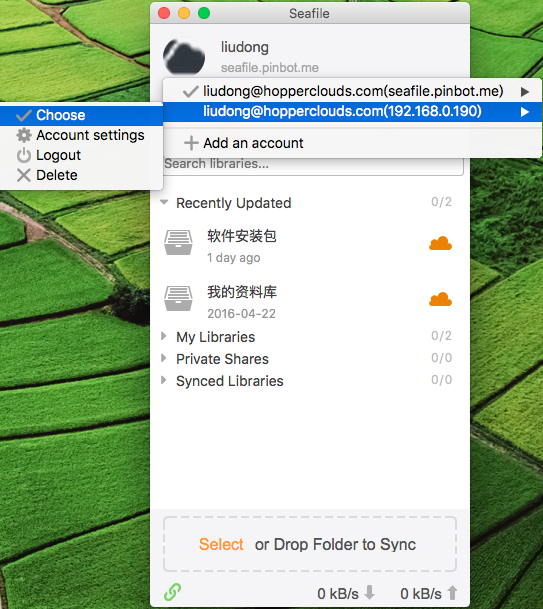  

###2.5 客户端文件共享

选择共享目录
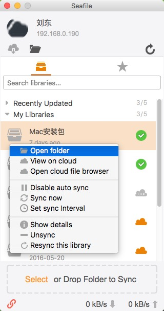  

####2.5.1 内部外链共享
打开共享目录——>选择需要共享的文件——>右键 获取Seafile内部外链——>复制Seafile Web Link 链接——发送给被共享成员
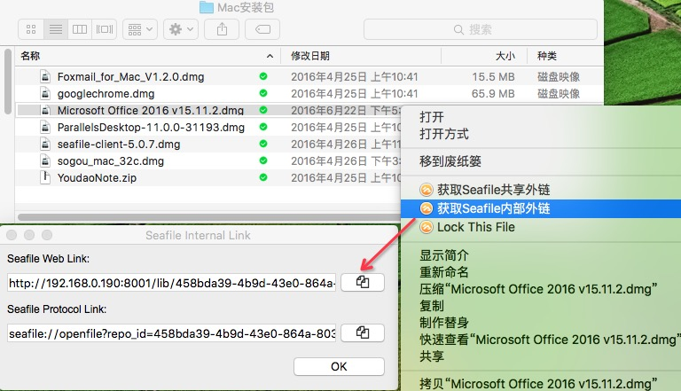  

访问共享链接界面
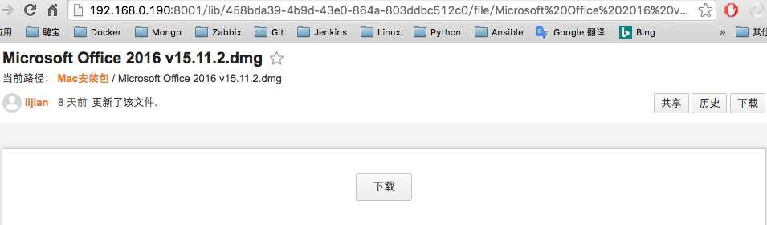

将文件共享其他成员——>选择共享
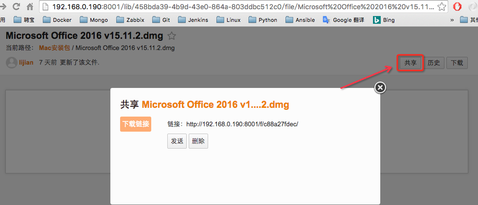

选择发送
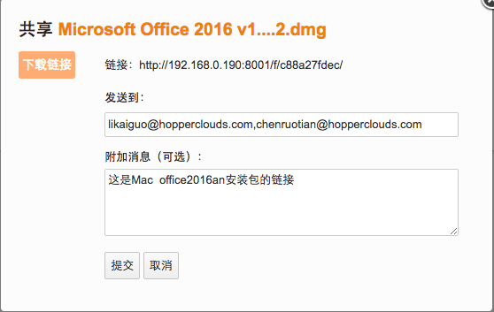

####2.5.2 外部共享
打开共享目录——>选择需要共享的文件——>右键 获取Seafile共享外链——>复制Share Link 链接——发送给被共享成员
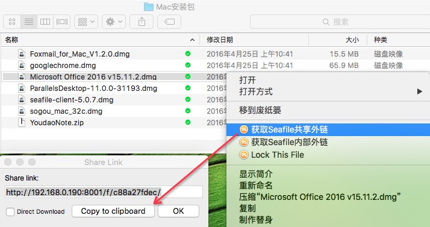  

访问共享链接界面
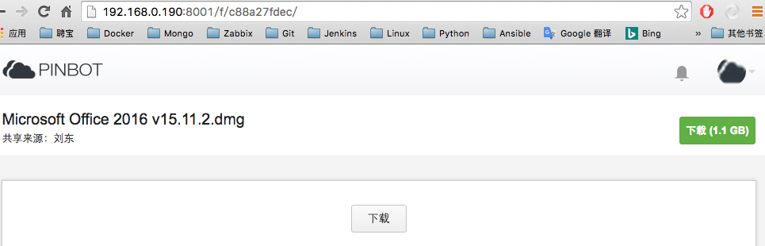