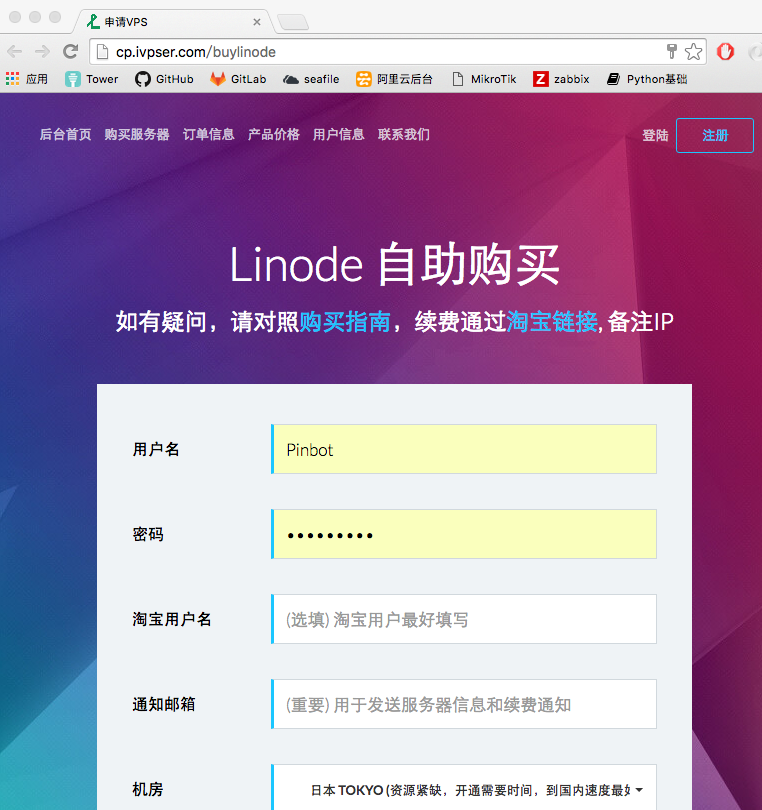
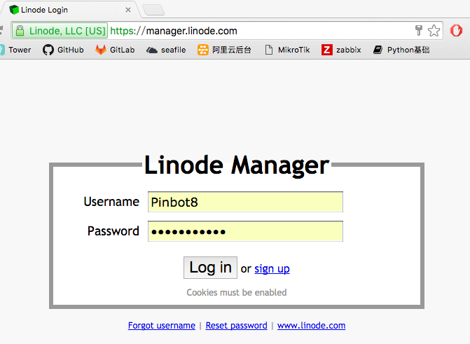
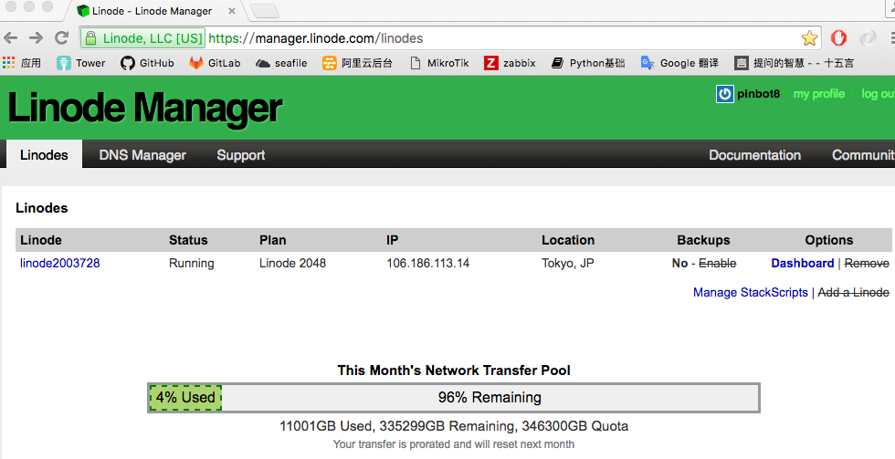
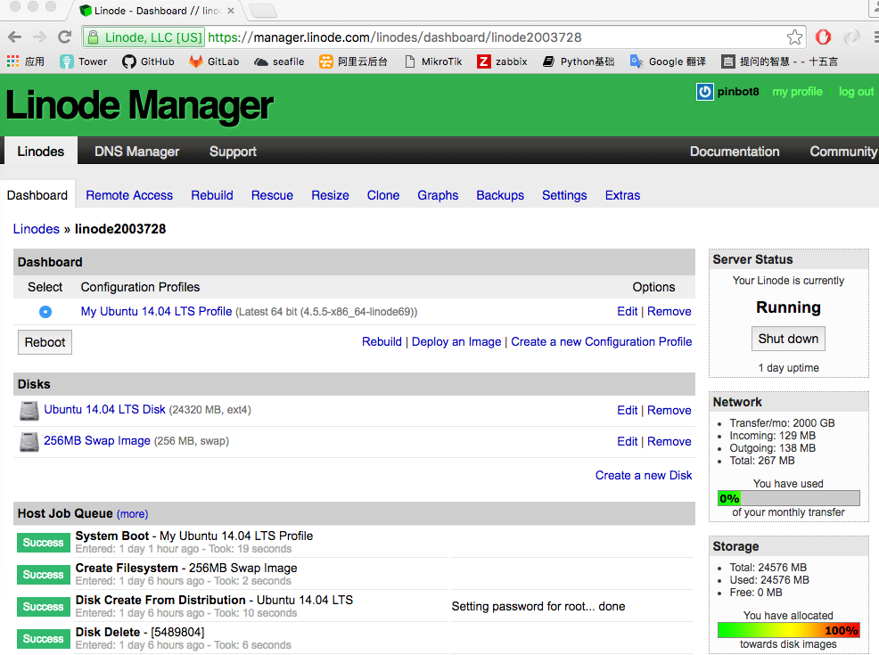
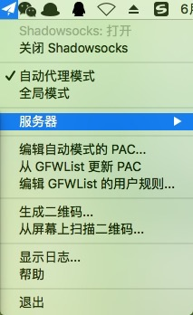
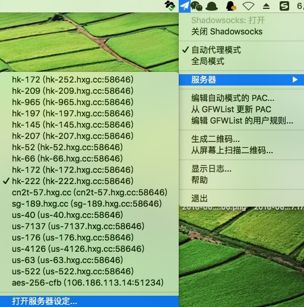
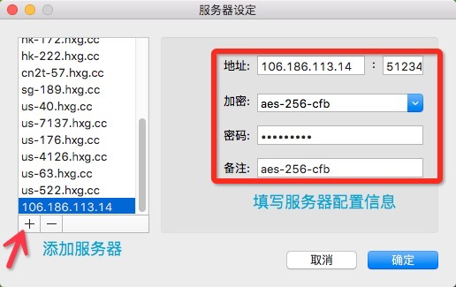

## VPS使用及Shadowsocks Server部署

Linode日本主机[https://www.linode.com/pricing](https://www.linode.com/pricing)(只有最快，没有更快)  
优点：  
1、连接速度高；  
2、稳定性较好；  
3、网络延迟很小；  
4、可以部署shadowsocks, 部署公司网站(不需要备案)。  
缺点：购买机器价格较高；


测试主机: [http://speedtest.tokyo.linode.com/100MB-tokyo.bin](http://speedtest.tokyo.linode.com/100MB-tokyo.bin)


Linode机器购买帮助指南：  
1. 首月指今天到月底最后一天，不足一个整月的按天计价；  
2. 价格计算公式：[http://www.ivpser.com/%E4%BA%A7%E5%93%81%E4%BB%B7%E6%A0%BC](http://www.ivpser.com/%E4%BA%A7%E5%93%81%E4%BB%B7%E6%A0%BC)  
3. 自助购买的最全指南：[http://www.ivpser.com/linode-buy-yourself](http://www.ivpser.com/linode-buy-yourself)

Linode 按自然月购买, 首月通过自助购买平台 [http://cp.ivpser.com/buylinode](http://cp.ivpser.com/buylinode)  


账号信息：  
后台面板: [http://manager.linode.com](http://manager.linode.com)  
用户名: Pinbot8, 密码: Pinbot8123a  
默认SSH帐号:root, 密码:linodePass  
IP 地址: 106.186.113.14  

后台登录界面：  


后台管理界面：  


VPS实例界面：  


登录方式：ssh root@106.186.113.14

Linode的配置和部署:
[http://www.ivpser.com/how-to-depoly/](http://www.ivpser.com/how-to-depoly/)


##Shadowsocks Server部署安装
1、服务端安装：

更新软件源
```
sudo apt-get update
```

2、安装 pip 及 ShadowSocks server
```
sudo apt-get install python-pip
pip install shadowsocks
mkdir /etc/shadowsocks/
mv /root/.kxrr/ss-server.json /etc/shadowsocks/server.conf
```
3、修改 ShadowSocks server 配置文件如下：
```
vim /etc/shadowsocks/server.conf
{
"server":"106.186.113.14",
"server_port":51234,
"local_port":1080,
"password":"pinbot123",
"timeout":600,
"method":"aes-256-cfb"
}
```
4、ShadowSocks server 启动
```
/usr/bin/python /usr/local/bin/ssserver -c /etc/shadowsocks/server.conf -d start
```
5、ShadowSocks server 日志查看
```
tail -f /var/log/shadowsocks.log                                                                    
2016-06-21 03:31:22 INFO     starting server at 106.186.113.14:51234
2016-06-21 03:33:19 INFO     connecting www.google.com.hk:443 from 61.139.78.89:51608

注：日志检测到 IP为 61.139.78.89（公司公网IP） 的主机访问google地址；

```
6、ShadowSocks server 加入开机自启动
```
vim /etc/rc.local     #在这个配置文件的exit 0前面一行加上

/usr/bin/python /usr/local/bin/ssserver -c /etc/shadowsocks/server.conf -d start
```
7、ShadowSocks GUI(客户端) 配置  
安装ShadowsocksX.app
下载地址：[https://shadowsocks.com/client.html](https://shadowsocks.com/client.html)  
seafile私有云——>开发环境安装包——>	ShadowsocksX.app.zip (MAC版本)  

配置步骤：  
安装后打开Shadowsocks——>服务器——>打开服务器设定——>“+” 添加服务器——>填写服务端配置文件  





